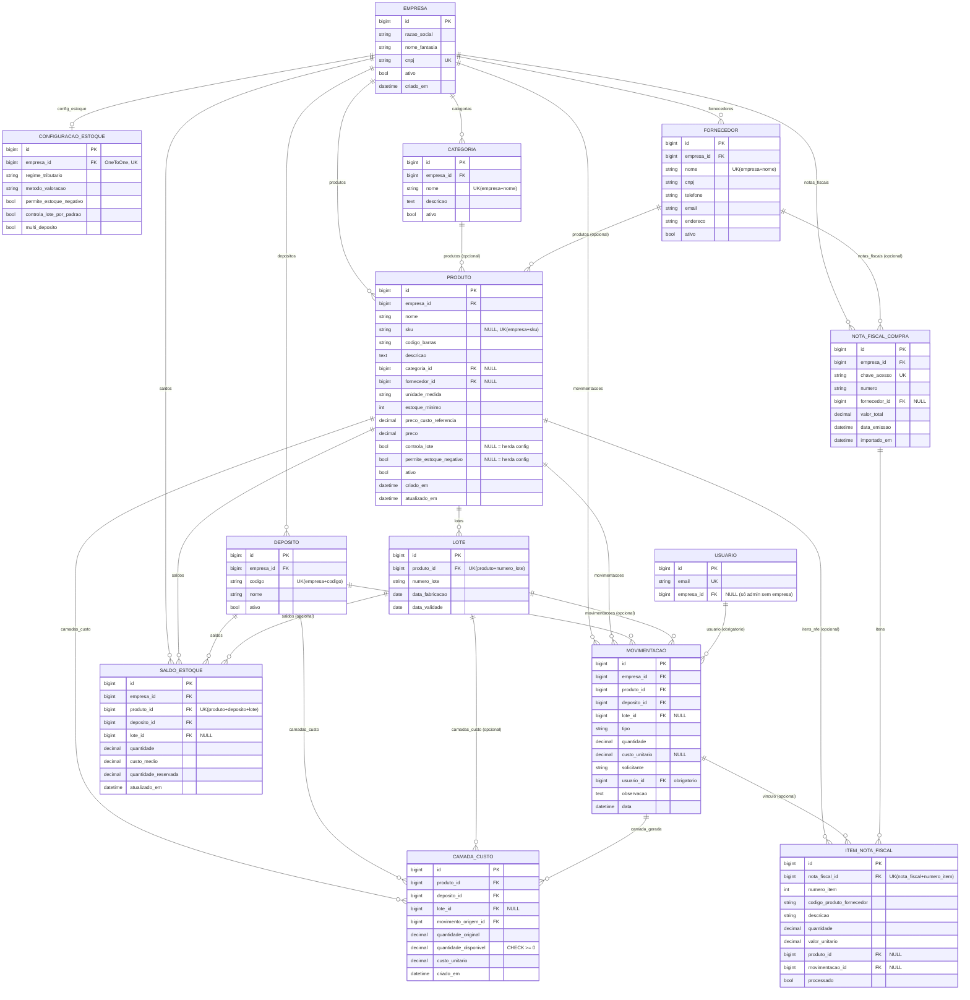

# Controle de Estoque — Angular + Django REST Framework


Projeto de estudo para entender, na prática, como o frontend (Angular) se
comunica com o backend (Django + DRF) via HTTP/REST.

## Estrutura

```
estoque/
├── backend/            Django + DRF
│   ├── estoque_backend/    settings, urls raiz
│   ├── contas/              usuário customizado (login por e-mail) + registro/confirmação
│   └── estoque/             app com models, serializers, views, urls, admin
│       ├── services.py          ServicoEstoque — único ponto de escrita de saldo/ledger
│       └── nfe.py               parsing puro do XML de NF-e (sem acesso a banco)
└── frontend/           Angular (standalone components)
    └── src/app/
        ├── models/          interfaces TypeScript (espelham os serializers)
        ├── services/        chamadas HTTP (HttpClient)
        ├── guards/          authGuard (protege rotas autenticadas)
        ├── interceptors/    injeta o token e trata erros de HTTP
        └── components/      telas (produto, categoria, fornecedor, movimentação,
                              importações, login, registro, confirmar-email)
```

## Modelo de dados



Diagrama reflete o schema atual em `backend/estoque/models.py` e
`backend/contas/models.py` (`NOTA_FISCAL_COMPRA`/`ITEM_NOTA_FISCAL` no
diagrama são `NotaFiscalCompra`/`ItemNotaFiscalCompra` no código).

### O que cada entidade representa

- **`Empresa`**: o tenant raiz. Toda entidade de negócio (produto, categoria,
  fornecedor, depósito, movimentação, saldo, nota fiscal) pertence a uma
  `Empresa`, e a API isola os dados por ela — é o que dá o "multi" do
  multi-tenant.
- **`Usuario`** (`contas.Usuario`): a conta de login, por e-mail (sem
  `username`). Toda movimentação registra qual `Usuario` a lançou. `empresa`
  é `NULL` só para contas administrativas (`createsuperuser`, uso exclusivo
  do `/admin`) — qualquer outra conta sem empresa recebe 403 na API de
  negócio.
- **`ConfiguracaoEstoque`**: parametrização de uma `Empresa` — qual método de
  custeio usar (média móvel/FIFO/custo padrão), regime tributário, e os
  padrões herdados por produtos que não definem override (`controla_lote`,
  `permite_estoque_negativo`). Toda empresa tem exatamente uma.
- **`Categoria`** e **`Fornecedor`**: cadastros de referência para
  `Produto`, únicos por nome dentro de cada empresa. Podem ser inativados
  (nunca excluídos) e continuam existindo mesmo sem produtos vinculados.
- **`Deposito`**: o local físico/lógico onde o estoque é guardado. Hoje toda
  empresa tem exatamente um depósito "PADRAO" (criado junto no cadastro);
  múltiplos depósitos e transferência entre eles são um próximo passo.
- **`Produto`**: o item cadastrado (nome, SKU, unidade de medida, preço de
  venda, etc.). Não guarda mais uma quantidade própria — o saldo é sempre
  derivado do ledger de `Movimentacao` (ver `SaldoEstoque`). Pode exigir
  controle de lote e pode ou não permitir saldo negativo, herdando o padrão
  da empresa quando não definido explicitamente.
- **`Lote`**: subdivisão opcional de um `Produto` por número de
  lote/validade, só relevante quando o produto exige controle de lote.
- **`Movimentacao`**: o ledger — todo evento de entrada ou saída de estoque
  (requisição, devolução, compra, ajuste de inventário `+`/`-`) é um
  registro aqui, com quantidade, custo, depósito, lote (se aplicável) e o
  `Usuario` que lançou. É a fonte de verdade histórica; nunca é editada
  depois de criada.
- **`SaldoEstoque`**: o saldo e custo médio *atuais* de um produto num
  depósito/lote, cacheado e recalculado a cada `Movimentacao` por
  `ServicoEstoque` dentro de uma transação com lock — existe para consulta
  rápida, sem precisar somar o ledger inteiro toda vez.
- **`CamadaCusto`**: só usada pela estratégia de custeio FIFO — cada entrada
  de estoque vira uma camada com sua própria quantidade/custo, consumida em
  ordem na hora da saída. Média móvel e custo padrão não usam essa tabela.
- **`NotaFiscalCompra`** e **`ItemNotaFiscalCompra`**: registro da
  importação de uma NF-e de compra e de cada item dela — guardam o
  casamento (ou pendência) entre item da nota e `Produto`/`Movimentacao`,
  permitindo reimportar o mesmo arquivo sem duplicar estoque.

## Funcionalidades

- **Autenticação por token** (DRF Token Auth) **com login por e-mail**: o
  modelo de usuário é customizado (`contas.Usuario`, `AUTH_USER_MODEL`),
  sem campo `username` — o e-mail é o identificador único desde o cadastro
  (`createsuperuser` já pede só e-mail/senha). Guard de rotas e interceptor
  HTTP anexam o token e tratam 401. A tela de login (`/login`) usa um
  layout dividido — formulário à esquerda, ilustração temática de estoque
  à direita (escondida em telas estreitas).
- **Cadastro de conta + empresa com confirmação por e-mail** (`/registro`):
  cria a conta do usuário e a empresa dele numa transação só (`Empresa` +
  `ConfiguracaoEstoque` padrão + `Deposito` "PADRAO"), com a conta inativa
  até confirmar. `POST /api/auth/registro/` dispara um e-mail (em dev, cai
  no console do `runserver` — ver `EMAIL_BACKEND`) com um link pra
  `/confirmar-email/:uid/:token`; confirmar já loga automaticamente
  (`POST /api/auth/confirmar-email/` devolve token de sessão, igual ao
  login). O token de confirmação usa o mesmo mecanismo do "esqueci minha
  senha" do Django (`PasswordResetTokenGenerator`) — sem tabela própria,
  e o link antigo já vira inválido sozinho assim que a conta é confirmada.
- **Multi-tenant de verdade**: cada `contas.Usuario` pertence a uma
  `Empresa` (`usuario.empresa`), e toda a API filtra por ela — produtos,
  categorias, fornecedores e movimentações de uma empresa nunca aparecem
  pra outra, e não dá pra criar um produto referenciando a categoria/
  fornecedor/produto de outra empresa (os `PrimaryKeyRelatedField` desses
  relacionamentos são escopados por empresa no serializer). Contas sem
  empresa (ex: um superuser criado via `createsuperuser`, pensado só pro
  `/admin`) recebem 403 ao chamar a API de negócio.
- **Produtos**: cadastro completo — nome, SKU, código de barras, categoria,
  fornecedor, unidade de medida, estoque mínimo, preço de custo de referência,
  preço de venda e status ativo/inativo. O saldo em estoque **não é mais um
  campo do produto** — é derivado do ledger de movimentações (ver abaixo).
- **Categorias** e **Fornecedores**: CRUD completo, usados como referência
  no cadastro de produtos. Também têm status ativo/inativo.
- **Inativação em vez de exclusão**: Produtos, Categorias e Fornecedores nunca
  são removidos do banco. O botão de remoção nas listagens (e o `DELETE` da
  API) apenas define `ativo=False`; o registro pode ser reativado depois,
  editando o cadastro e marcando o campo "ativo" novamente.
- **Saldo de estoque derivado do ledger**: `Produto` não guarda mais uma
  quantidade mutável. Toda entrada/saída é uma `Movimentacao` (requisição,
  devolução, compra, ajuste de inventário `+`/`-`), e o saldo/custo ficam
  cacheados em `SaldoEstoque`, sempre recalculados por
  `ServicoEstoque.registrar_entrada`/`registrar_saida` (backend/estoque/services.py)
  numa única transação com lock de linha — corrige uma condição de corrida
  que existia na versão anterior (`Produto.quantidade +=/-=` sem lock).
  Requisições/ajustes negativos que deixariam o saldo negativo são bloqueados
  (a menos que o produto ou a empresa liberem estoque negativo).
- **Motor de custeio parametrizável por empresa** (`ConfiguracaoEstoque.metodo_valoracao`):
  o cálculo de custo de cada movimentação é delegado a uma estratégia —
  **média móvel** (padrão), **FIFO** (com camadas de custo em `CamadaCusto`,
  consumidas na ordem de entrada) ou **custo padrão** (sempre valoriza o
  saldo por `Produto.preco_custo_referencia`, preservando o preço de compra
  real no movimento de entrada). Produtos podem exigir controle de lote
  (`Produto.controla_lote`/`ConfiguracaoEstoque.controla_lote_por_padrao`).
- **`Deposito`**: ainda é só *scaffolding* — toda empresa (inclusive a
  criada no `/registro`) ganha um único depósito "PADRAO" automaticamente;
  múltiplos depósitos por empresa e transferência entre eles ficam pra uma
  PR futura.
- **Histórico de movimentações por produto**: tela de detalhe
  (`/produtos/:id/historico`, acessível pelo botão "Histórico" na lista)
  mostrando os dados do produto (incluindo saldo atual) e só as
  movimentações daquele produto (`GET /api/movimentacoes/?produto=<id>`),
  com filtro opcional por período (`&data_inicio=AAAA-MM-DD&data_fim=AAAA-MM-DD`
  — datas inválidas são ignoradas em vez de quebrar a listagem).
- **Importações** (tela própria em `/importacoes`, um item no menu principal):
  - **CSV** de Produtos, Categorias e Fornecedores: upsert por nome (atualiza
    o que já existe, cria o que não existe), células vazias não sobrescrevem
    valores já cadastrados, e categoria/fornecedor referenciados por nome são
    criados automaticamente se não existirem. A coluna `quantidade` do CSV de
    produtos não sobrescreve o saldo direto — gera um ajuste de inventário
    (`AJUSTE_POSITIVO`/`AJUSTE_NEGATIVO`) com histórico.
  - **NF-e (XML)** de compra: dá entrada em estoque casando cada item da nota
    com um produto existente por SKU (código do fornecedor) ou nome, via
    `ServicoEstoque` (tipo `COMPRA`, atualizando custo médio pelo valor
    unitário da nota). Itens sem correspondência **não criam produto
    automaticamente** — ficam pendentes até o produto ser cadastrado
    manualmente e o mesmo arquivo ser reimportado (reimportar é idempotente:
    itens já processados não duplicam estoque). Quantidades fracionárias
    (ex: 2,5 kg) são aceitas normalmente.
  - Arquivos de exemplo para testar a importação de CSV em `exemplos-csv/`
    (`categorias.csv`, `fornecedores.csv`).
- **Paginação** nas listagens (a API aceita `?page=` e `?page_size=`).
- **Filtros de busca na listagem de produtos**: por nome (busca parcial,
  sem diferenciar maiúsculas/minúsculas, com debounce de 300ms no campo de
  texto) e por categoria/fornecedor (selects), combináveis entre si
  (`GET /api/produtos/?nome=&categoria=<id>&fornecedor=<id>`).
- **Filtro de busca por nome nas listagens de Categoria e Fornecedor**: mesmo
  padrão de busca parcial/case-insensitive com debounce de 300ms
  (`GET /api/categorias/?nome=`, `GET /api/fornecedores/?nome=`).

### Padrão de telas

Toda entidade (Produto, Categoria, Fornecedor) segue o mesmo padrão de UI:
a lista tem um botão **"+ Criar"** no topo e, por linha, os botões **"Editar"**
e **"Inativar"** (só aparece em registros ativos); ambos os cadastros levam a
uma tela de formulário separada (`.../novo` ou `.../:id/editar`), que decide
entre criar e atualizar conforme a presença do `id` na rota. As listas em si
só mostram dados e essas ações — import/export de arquivo (CSV/NF-e) fica
centralizado na tela **Importações**, não em cada lista.

## Como rodar

### Backend

```bash
cd backend
python -m venv venv
source venv/bin/activate      # Windows: venv\Scripts\activate
pip install -r requirements.txt
python manage.py migrate
python manage.py createsuperuser   # pede só e-mail/senha; necessário pra logar no frontend e acessar /admin
python manage.py runserver
```

API disponível em `http://localhost:8000/api/` (autenticação por token
obrigatória, exceto as três rotas de `/api/auth/` abaixo):
- `POST /api/auth/registro/` — cria a conta (inativa) + a empresa do usuário
- `POST /api/auth/confirmar-email/` (`{"uid", "token"}`) — confirma a conta e já loga
- `POST /api/auth/token/` — login por e-mail (`{"email": ..., "password": ...}`), retorna o token do usuário
- `GET/POST /api/produtos/`, `GET/PUT/DELETE /api/produtos/{id}/`
  (`GET` aceita `?nome=`, `?categoria=<id>`, `?fornecedor=<id>` para filtrar;
  `DELETE` inativa — define `ativo=False` — em vez de remover o registro)
- `POST /api/produtos/importar_csv/`, `GET /api/produtos/exportar_csv/`
- `POST /api/produtos/importar_nfe/` — dá entrada em estoque a partir do XML de uma NF-e de compra
- `GET/POST /api/categorias/`, `GET/PUT/DELETE /api/categorias/{id}/`
  (`GET` aceita `?nome=` para filtrar; `DELETE` inativa em vez de remover)
- `POST /api/categorias/importar_csv/`, `GET /api/categorias/exportar_csv/`
- `GET/POST /api/fornecedores/`, `GET/PUT/DELETE /api/fornecedores/{id}/`
  (`GET` aceita `?nome=` para filtrar; `DELETE` inativa em vez de remover)
- `POST /api/fornecedores/importar_csv/`, `GET /api/fornecedores/exportar_csv/`
- `GET/POST /api/movimentacoes/`, `?produto=<id>` filtra o histórico de um produto,
  `?data_inicio=AAAA-MM-DD` e/ou `?data_fim=AAAA-MM-DD` restringem por período

### Frontend

```bash
cd frontend
npm install
npm start
```

Acesse `http://localhost:4200` e crie uma conta em `/registro` (cria a sua
empresa junto) — em dev, o e-mail de confirmação cai no console do
`runserver`, copie o link de lá. Ou, se preferir, faça login em `/login`
com o e-mail/senha de um `createsuperuser` já existente.

> O CORS já está liberado no backend para `localhost:4200` (ver
> `CORS_ALLOWED_ORIGINS` em `settings.py`).

## Deploy (Render, camada gratuita)

Tudo definido como código em `render.yaml` (na raiz do repo) — um Blueprint
do Render com três recursos:

- **`estoque-backend`** (Web Service, Python, plano free): builda com
  `backend/build.sh` (`pip install` + `collectstatic` + `migrate`) e sobe com
  `gunicorn estoque_backend.wsgi:application`.
- **`estoque-frontend`** (Static Site, plano free, sem sleep): builda com
  `frontend/build.sh`, que gera `environment.prod.ts` apontando pra URL do
  backend (recebida via `fromService`, então não fica hardcoded) antes de
  rodar `ng build`. Publica `dist/estoque-frontend/browser`, com uma regra de
  rewrite (`/*` → `/index.html`) pra não quebrar as rotas do Angular Router
  em recarregamentos/deep links.
- **`estoque-db`** (Postgres, plano free): ligado ao backend via
  `DATABASE_URL` (`fromDatabase`).

`SECRET_KEY` é gerado automaticamente pelo Render (`generateValue: true`);
`FRONTEND_URL`/`CORS_ALLOWED_ORIGINS` do backend e a URL de API do frontend
são resolvidos entre os dois serviços via `fromService` — nenhuma URL fica
fixa no código, exceto os nomes dos serviços no próprio `render.yaml`.

### Como subir

1. No dashboard do Render: **New > Blueprint**, conecte este repositório e
   aponte pro `render.yaml` na raiz — ele cria os três recursos de uma vez.
2. Depois do primeiro deploy, todo `git push` na `main` reimplanta os dois
   serviços automaticamente (comportamento nativo do Render pra serviços
   ligados a um Blueprint) — sem passo extra de CI/CD.
3. Para criar a sua conta no ambiente publicado, use o `/registro` do próprio
   frontend implantado (mesmo fluxo do dev local) — não precisa de
   `createsuperuser` pra isso. Se quiser acesso ao `/admin`, rode
   `python manage.py createsuperuser` manualmente pelo Shell do serviço no
   Render.

### Limitações da camada gratuita (aceitas conscientemente)

- **Postgres free expira**: 30 dias após criado, mais 14 dias de carência —
  depois disso o banco (e os dados) são apagados se não virar um plano pago.
  Pra um projeto de estudo, o esperado é recriar o banco quando expirar.
- **Web Service free dorme**: depois de ~15 min sem requisição, o backend
  hiberna; a primeira requisição seguinte demora uns 30-60s pra "acordar" o
  serviço. O Static Site do frontend não tem esse problema (fica sempre no
  ar).
### E-mail (SMTP do Gmail)

Em produção, `render.yaml` já configura `EMAIL_BACKEND` para
`smtp.EmailBackend` apontando pro `smtp.gmail.com:587` (TLS). Faltam só as
credenciais, que ficam de fora do repo (`sync: false` no Blueprint — o Render
pede o valor manualmente):

1. Ative a verificação em duas etapas na conta Gmail que vai enviar os
   e-mails (obrigatório pro passo seguinte).
2. Gere uma **App Password** em
   https://myaccount.google.com/apppasswords (não é a senha normal da conta).
3. No dashboard do Render, no serviço `estoque-backend` → **Environment**,
   preencha:
   - `EMAIL_HOST_USER`: o endereço Gmail completo (ex.: `voce@gmail.com`).
   - `EMAIL_HOST_PASSWORD`: a App Password gerada no passo 2 (sem espaços).
   - `DEFAULT_FROM_EMAIL`: o mesmo endereço Gmail — o Gmail rejeita/ignora um
     "From" diferente da conta autenticada.
4. Redeploy do `estoque-backend` (o Render costuma pedir isso sozinho após
   salvar env vars novas).

Em dev local, o `EMAIL_BACKEND` continua o `console.EmailBackend` (link de
confirmação cai no terminal do `runserver`) — não precisa de credenciais
reais pra desenvolver.

## Testes

### Backend (pytest-django)

```bash
cd backend
source venv/bin/activate
pip install -r requirements-dev.txt
python -m pytest                              # roda a suíte
python -m pytest --cov=estoque --cov-report=term-missing   # com cobertura
```

Testes em `estoque/tests/`: models (unicidade por empresa, defaults,
`__str__`), API (CRUD, autenticação obrigatória, upsert de CSV, criação
automática de categoria/fornecedor por nome, filtros de busca por nome/
categoria/fornecedor) e as regras de negócio de estoque em `Movimentacao`
(saldo insuficiente bloqueado, ajuste de inventário `+`/`-`, saldo/custo
médio sempre lidos via `ServicoEstoque`). `test_api_nfe.py` cobre o import
de NF-e: matching por SKU/nome, reimportação idempotente (mesmo arquivo não
duplica estoque), item pendente resolvido após cadastro manual +
reimportação, quantidade fracionária aceita, e matching de fornecedor por
CNPJ normalizado. `test_isolamento_multi_tenant.py` é o teste mais
importante do multi-tenant: confirma que produtos/categorias/fornecedores/
movimentações de uma empresa não aparecem, nem podem ser referenciados,
por outra.

Testes em `contas/tests/`: cadastro (cria empresa+depósito+configuração,
e-mail enviado, e-mail/CNPJ duplicado rejeitado, senha fraca rejeitada,
login bloqueado antes de confirmar) e confirmação de e-mail (token válido
ativa e loga, token inválido/adulterado/reutilizado é rejeitado).

### Frontend (Jest + TestBed)

```bash
cd frontend
npm install
npm test
```

Testes em arquivos `*.spec.ts` ao lado de cada arquivo testado: services
(via `HttpClientTestingModule`), guard/interceptors de autenticação e os
componentes mais representativos (`produto-list`, `produto-form`,
`produto-historico`, `importacoes`, `login`, `registro`, `confirmar-email`,
`movimentacao-form`, incluindo o `AsyncValidator` de estoque).

### CI

`.github/workflows/ci.yml` roda as duas suítes a cada push/PR para `main`:
o job `backend-tests` (pytest-django) e o job `frontend-tests` (Jest +
TestBed), em jobs separados e paralelos. O badge no topo do README reflete
o status da última execução na `main`.

## Onde está o "como o frontend faz requisições"

Esse é o objetivo do projeto, então vale destacar os arquivos certos:

1. **`src/app/services/*.service.ts`** (`produto`, `categoria`, `fornecedor`,
   `movimentacao`, `auth`) — aqui é onde o `HttpClient` do Angular monta as
   chamadas (`get`, `post`, `put`, `delete`) para a API REST. Cada método
   retorna um `Observable`.

2. **`src/app/interceptors/auth.interceptor.ts`** — anexa o header
   `Authorization: Token <...>` em toda requisição. **`error.interceptor.ts`**
   trata erros HTTP: em 401 faz logout e redireciona para `/login`; nos
   demais casos, normaliza a mensagem de erro vinda do DRF.

3. **`src/main.ts`** — registra `provideHttpClient()` na aplicação. Sem isso
   o `HttpClient` não pode ser injetado em nenhum service.

4. **Componentes `*-list`** (listagem + CRUD) e **`*-form`** (criação/edição)
   — chamam os services e usam `.subscribe({ next, error })` para tratar
   sucesso e erro da requisição, atualizando o estado do componente (que a
   template reflete automaticamente via data binding). O componente
   **`importacoes`** segue o mesmo padrão para os uploads de CSV/NF-e.

## Fluxo de uma requisição, ponta a ponta

Exemplo: registrar uma requisição de produto.

1. Usuário preenche o formulário em `movimentacao-form.component.html`
   (`ReactiveFormsModule`, com `AsyncValidator` que consulta o estoque
   disponível do produto selecionado).
2. Submit do form chama `registrar()` no componente.
3. `registrar()` chama `movimentacaoService.criar(this.form.getRawValue())`.
4. O service faz `POST http://localhost:8000/api/movimentacoes/` com o
   corpo em JSON.
5. No backend, `MovimentacaoViewSet.create()` valida os dados
   (`MovimentacaoSerializer.validate`, que barra requisição maior que o
   saldo disponível) e delega para `ServicoEstoque.registrar_entrada` ou
   `registrar_saida` (conforme o tipo), que grava a `Movimentacao` e
   atualiza o `SaldoEstoque` numa única transação com lock de linha,
   usando a estratégia de custeio da empresa.
6. A resposta (201 Created ou 400 com erro) volta pro Angular via
   `Observable`. `next` atualiza a UI com sucesso; `error` mostra a
   mensagem de validação vinda do DRF.

## Regras de negócio implementadas

- Requisição/ajuste negativo não pode exceder o saldo disponível em estoque
  (validado no serializer do backend, e também via `AsyncValidator` no
  formulário do Angular).
- A cada movimentação, `ServicoEstoque` atualiza o `SaldoEstoque` (e o custo
  médio, quando a movimentação é uma entrada com `custo_unitario`) dentro de
  uma transação com lock de linha — é o único código que escreve saldo.
- CSV de produtos: categoria e fornecedor podem ser referenciados pelo nome;
  se não existirem, são criados automaticamente na importação. A quantidade
  da planilha vira um ajuste de inventário (`ServicoEstoque.definir_saldo_inicial`),
  não uma sobrescrita direta.
- Import de NF-e: **não cria produto automaticamente** quando um item não
  casa com nenhum SKU/nome existente (ao contrário do CSV) — fica pendente
  até cadastro manual. O rastreamento é por item da nota (não pela nota
  inteira), então reimportar o mesmo arquivo depois de cadastrar o produto
  processa só o que faltava, sem duplicar o que já foi aplicado.
- Multi-tenant real: toda `Movimentacao`/`Produto`/`Categoria`/`Fornecedor`
  pertence à `Empresa` do usuário autenticado (`estoque/views.py:_empresa_do_usuario`),
  não a uma empresa "padrão" fixa — `ServicoEstoque.get_empresa_padrao()`
  ainda existe mas só é usada em testes/seed, não nas requisições reais.
- Login é por e-mail, não por username — o campo `username` não existe no
  modelo de usuário (`contas.Usuario`); `/api/auth/token/` só aceita
  `{"email": ..., "password": ...}`.

## Próximos passos sugeridos (para continuar estudando)

- Persistir os filtros de produtos na URL (query params), pra permitir compartilhar/recarregar a busca.
- Reenvio do e-mail de confirmação e fluxo de "esqueci minha senha" (hoje não existem).
- Convite de múltiplos usuários pra mesma empresa (hoje cada conta nova cria sua própria empresa).
- Múltiplos depósitos: expor `Deposito` na UI, `TRANSFERENCIA` entre depósitos e saldo por depósito no `SaldoEstoque`.
- Controle de lote/validade (`Lote`) e motor de custeio FIFO (`CamadaCusto`), parametrizável por `ConfiguracaoEstoque` (regime tributário/método de valoração).
